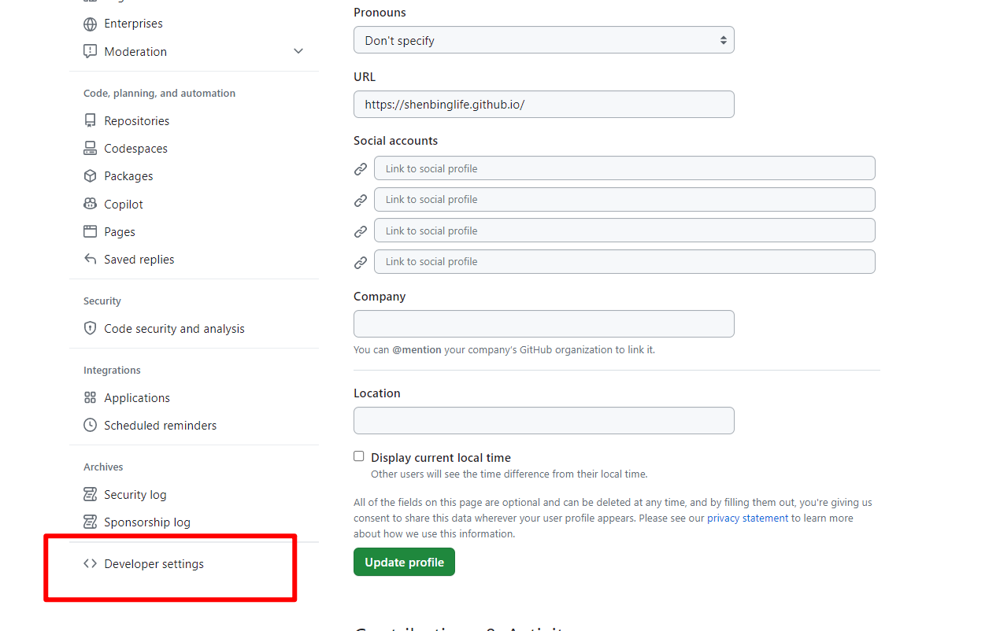
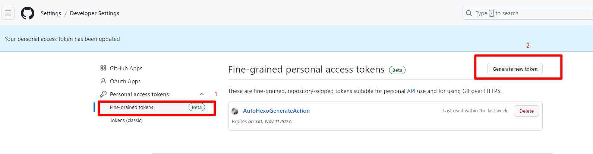
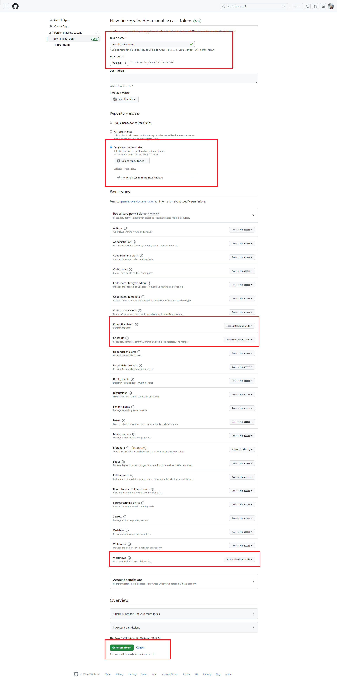
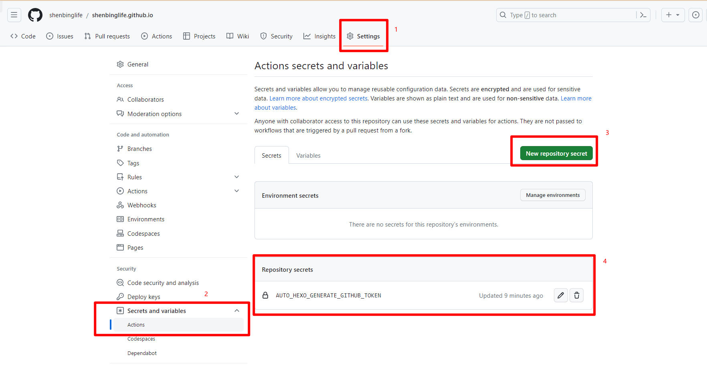

# 个人博客
基于hexo和next主题

hexo: 6.3.0  
next: 8.18.2

## 安装
```shell
# install nodejs
nvm install 20.8.0
nvm use 20.8.0

# install hexo and next theme
npm install -g hexo-cli
npm install hexo-theme-next
```

## 配置
修改_config.yml

```yaml
title: 散步留馨的博客
subtitle: ''
description: '唯美食与爱不可辜负'
keywords:
author: 散步留馨
language: zh-CN
timezone: ''

url: https://shenbinglife.github.io
permalink: :title/

post_asset_folder: true

theme: next
```

创建_config.next.yml

```yaml
scheme: Pisces

# 需要创建新的favicon文件名，否则默认next favicon会覆盖手动上传的favicon图片
favicon:
  small: /images/favicon-16x16.png
  medium: /images/favicon-32x32.png
  apple_touch_icon: /images/apple-icon.png
  safari_pinned_tab: /images/logo-512.svg

menu:
  home: / || fa fa-home
  about: /about/ || fa fa-user
  tags: /tags/ || fa fa-tags
  categories: /categories/ || fa fa-th
  archives: /archives/ || fa fa-archive

avatar:
  # Replace the default image and set the url here.
  url: /images/avatar.jpg
  # If true, the avatar will be displayed in circle.
  rounded: true

social:
GitHub: https://github.com/shenbinglife || fab fa-github
E-Mail: mailto:shenbinglife@163.com || fa fa-envelope
```

创建about，tags，categories文件夹

```shell
hexo new page about
hexo new page tags
hexo new page categories
```

打开每个文件夹的index.md，添加对应的type类型，例如`tags/index.md`
```markdown
---
title: tags
date: 2023-10-11 18:29:52
type: tags
---
```

上传favicon，推荐从[https://yesicon.app](https://yesicon.app)下载
```shell
mkdir source/images

# 将_config.next.yml中定义的favicon和avatar图片都上传到该文件夹中
```

## 本地运行
```shell
# 生成静态文件
hexo g

# 启动服务
hexo s
```

## Github Action 自动发布
参考
- [GitHub Actions 自动部署 Hexo 博客](https://blog.zhanganzhi.com/zh-CN/2022/06/0800d76d306e/)
- [利用 GitHub Action 自动部署 Hexo 博客](https://cloud.tencent.com/developer/article/2201648)

### 创建Github Token
选择用户Settings，进入Developer Settings


开始创建Fine-grained personal access tokens


选择Token的生效仓库和权限范围



## 保存Github Token
进入博客所在的仓库，将生成的Github Token保存为环境变量密钥


## 创建Github Action工作流
创建文件.github/workflows/auto_hexo_generate.yml

```yaml
name: AutoHexoGenerate # 部署

on: # 触发条件
  push:
    branches:
      - dev # 分支

  release:
    types:
      - published # 推送新版本号

  workflow_dispatch: # 手动触发

jobs:
  build:
    runs-on: ubuntu-latest

    steps:
#      - uses: actions/checkout@v2
#      - name: Setup tmate session
#        uses: mxschmitt/action-tmate@v3

      - name: Checkout # Checkout 仓库
        uses: actions/checkout@v2
        with:
          ref: dev

      - name: Setup Node # 安装 Node.js
        uses: actions/setup-node@v1
        with:
          node-version: "20.x"

      - name: Install Hexo # 安装 Hexo
        run: |
          npm install -g hexo-cli
          npm install

      - name: Generate # 生成
        run: |
          hexo clean
          hexo generate
      - name: Deploy # 部署
        run: |
          git config --global user.name "shenbing"
          git config --global user.email "shenbinglife@163.com"
          export TZ='Asia/Shanghai'
          cd public/
          git init -b main
          git add -A
          git commit -m "Create by workflows"
          git remote add origin https://github.com/shenbinglife/shenbinglife.github.io.git
          git push https://shenbinglife:${{ secrets.AUTO_HEXO_GENERATE_GITHUB_TOKEN }}@github.com/shenbinglife/shenbinglife.github.io.git -f
```