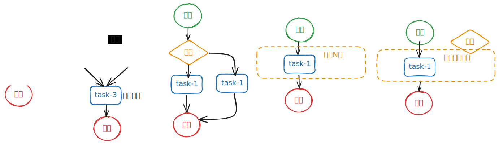

今天整理收藏夹，看到了一个项目收藏：[task-scheduler](https://github.com/TheBiiigBlue/task-scheduler)，所以今天的内容就是任务调度器相关的内容了，从单机到分布式的实现。
 
<!-- more -->
## 我遇到的调度器
调度器在我的职业生涯中，印象最深、最重要的几个产品分别是：Hadoop Yarn、K8s、DolphinsScheduler、Argo Exec。虽然他们的工作职责差异性蛮大的，但是核心都实现了资源分配和调度的能力。

### Hadoop Yarn：

**简介**：Hadoop Yarn 是 Hadoop 生态系统中的一个关键组件，用于资源管理和作业调度。  
**调度职责**：Yarn 负责在 Hadoop 集群中找到满足业务的资源，帮助作业启动任务，管理作业的生命周期。  

### K8s（Kubernetes）：

**简介**：Kubernetes 是一个开源的容器编排平台，自动化部署、扩展和管理容器化应用程序。  
**调度职责**：Kubernetes 的调度器负责将 Pod 放置到合适的节点上，以便对应节点上的 Kubelet 能够运行这些 Pod，考虑资源需求、亲和性、反亲和性、数据局部性等多种因素。

### Dolphinscheduler：

**简介**：Apache DolphinScheduler 是一个分布式、去中心化、易扩展的可视化 DAG 工作流任务调度系统。  
**调度职责**：DolphinScheduler 致力于解决数据处理流程中错综复杂的依赖关系，使调度系统在数据处理流程中开箱即用，支持多种任务类型和工作流的定时调度、依赖调度等。

### Argo Exec：

**简介**：Argo Workflows 是一个基于 Kubernetes CRD 实现的工作流管理工具，用于在 Kubernetes 上编排和管理系统作业和容器。  
**调度职责**：Argo Workflows 的 workflow-controller 组件负责解析用户创建的 CR 对象并启动 Pod 来真正运行流水线。  

### 核心能力
简单总结下上面的调度系统，核心能力分为以下，有可能只包含一两种（Yarn、K8s）：
1. **资源管理**，这里指能执行任务的资源，例如节点或者容器
2. **任务编排**，一般分为可视化编排，或者编程式编排
3. **任务调度**，将任务调度在节点上执行，并按照流程顺序执行所有的节点

所以，以后不管我们遇到什么样的调度系统、资源分配系统，都可以参考上面的系统概念和实现。而接下来，我要讲述的主要是：任务调度系统，要同时包含上述3种能力

## 调度系统中的角色

调度流程：
1. 获取任务，调度器负责从存储中获取待执行的任务
2. 获取资源，调度器从资源管理器中获取可以用来执行子任务的节点
3. 分发子任务，调度器在将任务拆解成子任务后，将子任务分发到资源节点上执行
4. 子任务完成后，资源节点可以将子任务状态，推送到调度器（或者被调度器拉取）
5. 调度器重复3和4的步骤，直到所有的子任务完成，标识着任务完成。
6. 调度器将任务结束的状态更新到存储中

调度角色：
- 任务存储：常见内存或者数据库存储任务信息
- 调度器：需要将任务拆分成子任务，并安排子任务调度到资源节点
- 资源管理器：管理集群中所有的资源节点状态，并分配给子任务资源
- 资源节点：资源节点上，一般运行资源节点监控服务，负责2个核心任务：1. 向资源管理器上报资源状态，2. 向调度器上报子任务状态

### 单机Java系统中的任务调度
我们在单机Java系统中，实现一个任务调度的系统，可以做出以下的调整：
1. 将线程池作为资源管理器，线程池中的线程作为资源节点；那么分发子任务就变成：提交线程任务

## 调度流程（DAG）

上面是一些常见的任务调度的流程，简单分类如下：
1. 顺序执行
2. 并发执行多个子任务，并阻塞等待所有子任务结束
3. 根据条件执行分支
4. 循环N次执行某一段任务流程
4. 循环执行某一段任务流程，直到条件允许退出循环

## 详细设计

### 任务信息Task
这里的任务信息，负责存储整个任务的执行流程（DAG），简单用点和边的概念就可以表示一个任务DAG。

Node:
- id
- data
- type：节点类型
    - 开始节点
    - 结束节点
    - 条件节点：根据执行结果，选择向下执行的边
    - Join节点：阻塞直到所有上游子任务成功结束后，才能执行
    - OneOf节点：阻塞直到任意一个上游子任务成功结束后，才能执行；并且取消所有其他的并行上游子任务
    - 子任务节点：这个节点表示，节点内也是一个任务流；且存在执行N次或者执行直到条件满足才结束

Edge:
- id
- from
- to

Task:
- edges
- nodes

注意：  
1. 如果不设置开始和结束节点类型的话，那么开始节点和结束节点，都需要计算
    - 没有父节点的节点，都是可以开始执行
    - 没有子节点的节点，都是可以在结束后终止

### 调度器接口
1. submit：提交任务

### 任务编排
这种的话，建议有可视化页面，提供一些内置节点，支持用户手动创建任务。

注意：
1. 对用户提交的任务进行DAG验证，防止出现死循环任务

## 单机Java调度系统的编程实战
待续